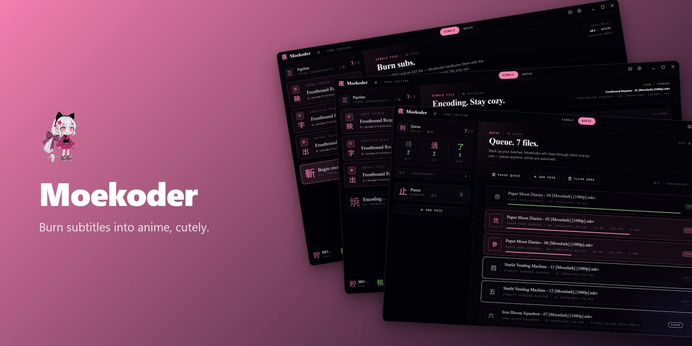
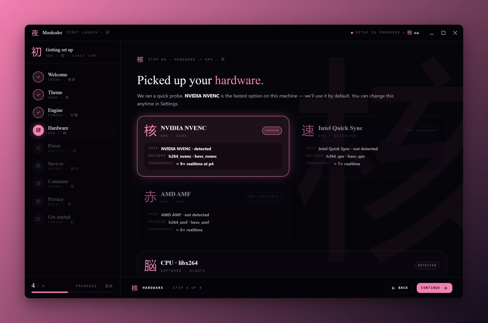
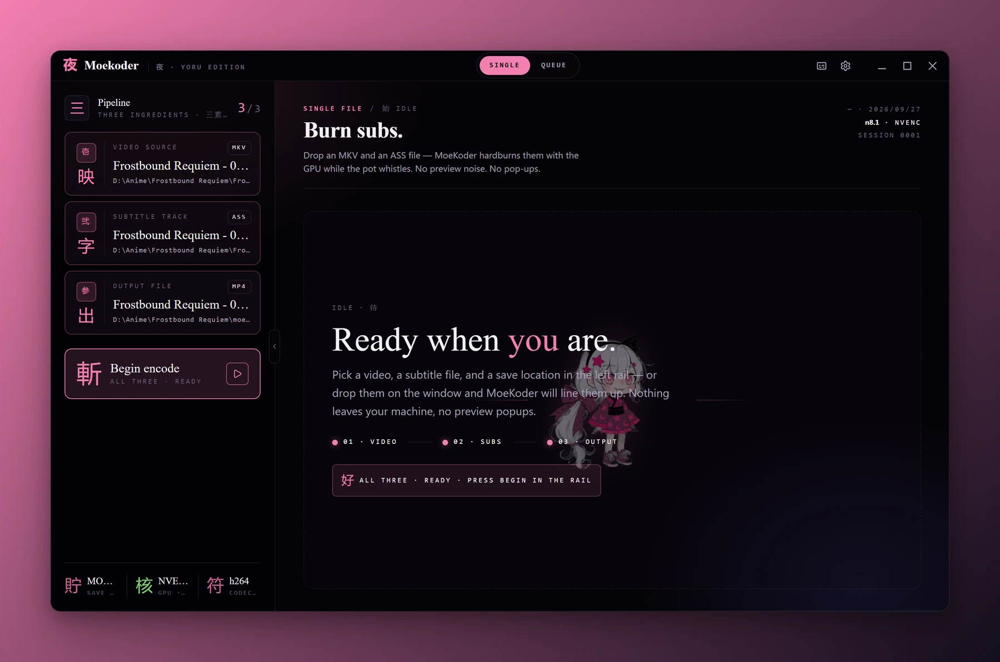
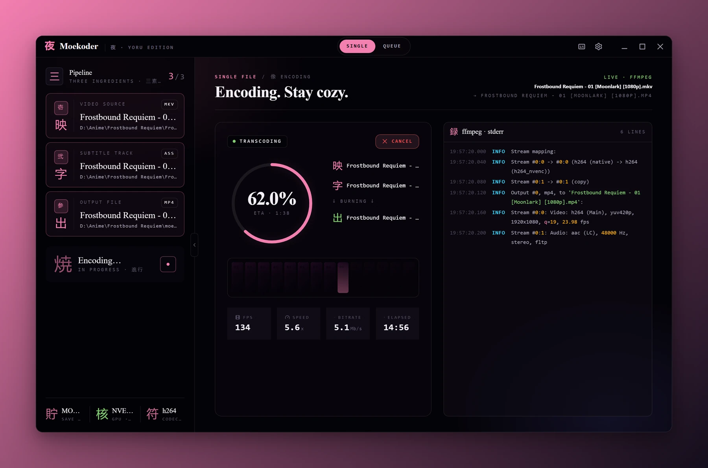
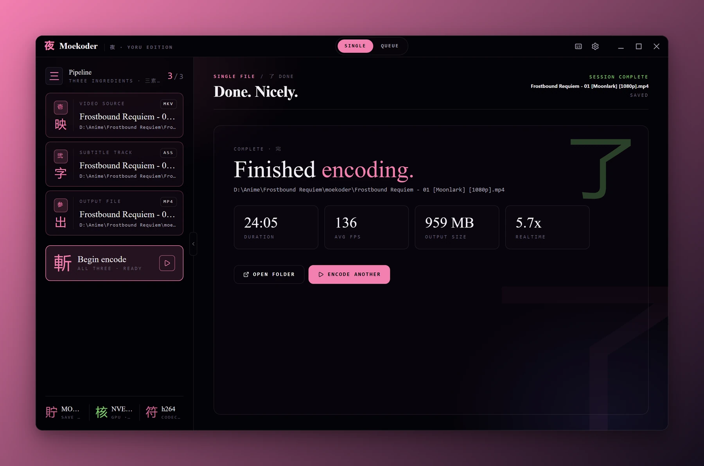
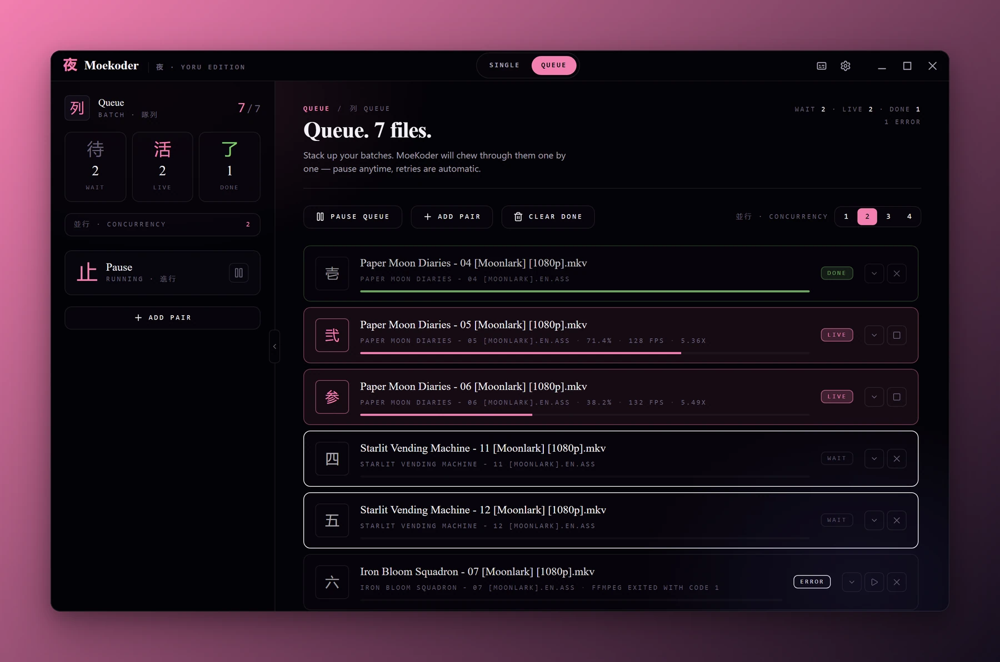
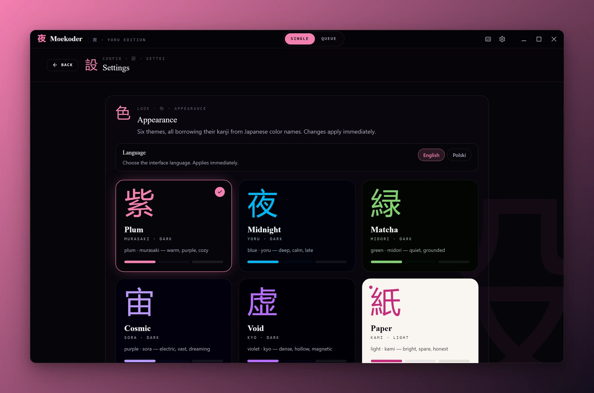
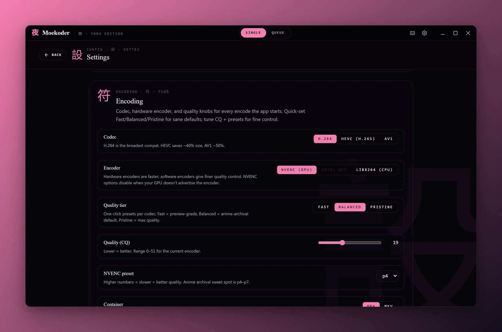
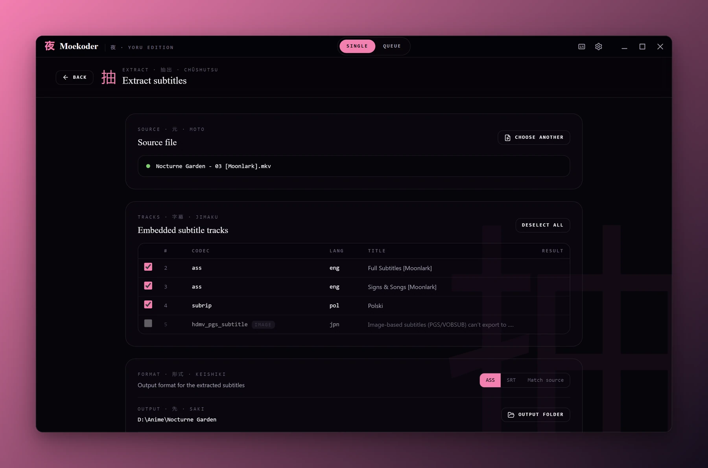

<a name="top"></a>

<div align="center">
  

  <h1>萌コーダー &nbsp;·&nbsp; Moekoder</h1>

  <p><strong>Burn subtitles into anime, cutely.</strong></p>

  <p>
    <a href="https://github.com/Shironex/moekoder/releases/latest">
      
    </a>
    <a href="https://github.com/Shironex/moekoder/actions/workflows/ci.yml">
      
    </a>
    
    <a href="LICENSE">
      
    </a>
  </p>

  <p>
    <a href="https://github.com/Shironex/moekoder/releases/latest"><strong>Download</strong></a>
    &nbsp;·&nbsp;
    <a href="CHANGELOG.md"><strong>Changelog</strong></a>
    &nbsp;·&nbsp;
    <a href="README.pl.md">Polski</a>
  </p>

  <blockquote>
    <p>For people who keep their anime on disk and already know what NVENC and CQ mean. Drop in an MKV and its ASS subtitles, get a hardsubbed MP4 back.</p>
  </blockquote>
</div>

---

## What is Moekoder?

Moekoder is a desktop hardsub tool. I built it to take one MKV and its ASS subtitle track, burn the subtitles in with libass through ffmpeg, copy the audio whenever the container allows it, and write an MP4 (or MKV) next to the source. It uses NVENC, Quick Sync or AMF when your machine has them and falls back to libx264 on the CPU. Everything runs locally, in a quiet dark plum window that stays out of the way.

It is part of my Shiro Suite, next to [ShiroAni](https://github.com/Shironex/shiroani) (anime), [Shiranami](https://github.com/Shironex/shiranami) (music) and [KireiManga](https://github.com/Shironex/kirei-manga) (manga).

## Screenshots

<table>
  <tr>
    <td width="50%"></td>
    <td width="50%"></td>
  </tr>
  <tr>
    <td align="center"><sub>The setup wizard detects your GPU and installs ffmpeg for you.</sub></td>
    <td align="center"><sub>Pick a video and its subtitles, then press Begin encode.</sub></td>
  </tr>
  <tr>
    <td width="50%"></td>
    <td width="50%"></td>
  </tr>
  <tr>
    <td align="center"><sub>A progress ring, a filmstrip and the ffmpeg log with fps, speed and ETA.</sub></td>
    <td align="center"><sub>The finished file with its duration, average fps, size and speed.</sub></td>
  </tr>
  <tr>
    <td width="50%"></td>
    <td width="50%"></td>
  </tr>
  <tr>
    <td align="center"><sub>A whole season in the queue, two episodes encoding at once.</sub></td>
    <td align="center"><sub>Six themes and the interface language, applied as you pick them.</sub></td>
  </tr>
  <tr>
    <td width="50%"></td>
    <td width="50%"></td>
  </tr>
  <tr>
    <td align="center"><sub>H.264, HEVC or AV1, the hardware encoder and a quality tier.</sub></td>
    <td align="center"><sub>Embedded subtitle tracks from an MKV, saved as ASS or SRT.</sub></td>
  </tr>
</table>

## What's inside

|                           |                                                                                                                                                                                                       |
| ------------------------- | ----------------------------------------------------------------------------------------------------------------------------------------------------------------------------------------------------- |
| **Hardsub encode**        | MKV and ASS in, MP4 or MKV out, with the subtitles burned in by libass. H.264, HEVC or AV1                                                                                                            |
| **Hardware encoders**     | Detects NVIDIA NVENC, Intel Quick Sync and AMD AMF, and checks each encoder with a one-frame test encode before offering it. libx264 on the CPU always works                                          |
| **Soft-sub mux**          | "Mux only" copies the video and audio and adds the subtitles as a separate MKV track, with no re-encode. The track language comes from the file name (`.en.ass`) or a manual override                 |
| **Subtitle extraction**   | Opens an MKV, lists its subtitle tracks and saves the text ones as ASS, SRT or their source format. Image tracks (PGS, VobSub) are listed but cannot be exported                                      |
| **Presets and benchmark** | Fast, Balanced and Pristine tiers per codec, your own named presets, and a benchmark that encodes a 10 second sample with up to four profiles and compares size, time and PSNR                        |
| **ffmpeg installer**      | ffmpeg is not bundled. On first launch Moekoder downloads it (BtbN builds on Windows, evermeet.cx on macOS), checks the SHA-256 and installs it into the app's data folder. Settings can reinstall it |
| **Disk-space check**      | Estimates the output size from the bitrate and checks free space, with a safety margin, before an encode or a queue run starts                                                                        |
| **Save targets**          | A `moekoder` folder next to the source, the source folder itself, a `subbed` folder, or a folder you pick                                                                                             |
| **Batch queue**           | Saved to disk as it changes, so it survives a restart. Runs 1 to 4 jobs at once, with pause, retries with backoff, drag to reorder, per-item logs and a notification when it finishes                 |
| **Drag and drop**         | Drop a video and its subtitles (or a whole folder) on the window and Moekoder pairs them by file name                                                                                                 |
| **Embedded fonts**        | Fonts attached to the MKV are extracted and passed to libass, so fansub typesetting renders with the right fonts. Can be turned off in Settings                                                       |
| **Smart audio**           | Audio is copied as is. For MP4 output, TrueHD, DTS, FLAC and PCM tracks (which MP4 cannot carry) are converted to AAC 192k                                                                            |
| **Live progress**         | Progress ring, filmstrip and the ffmpeg log, with fps, speed, bitrate and ETA                                                                                                                         |
| **Themes and languages**  | Six themes (Plum, Midnight, Matcha, Cosmic, Void, Paper), switched live. English and Polish UI, picked from your system language on first launch                                                      |
| **Nine-step onboarding**  | The first launch walks through theme, ffmpeg, GPU, preset, save location, container and privacy                                                                                                       |
| **Updates**               | Windows: checks GitHub Releases (automatic checks are opt-in), downloads when you ask and installs on quit. macOS: no in-app updater until the app is code-signed; the check opens Releases           |
| **Logs**                  | One click in Settings opens the logs folder                                                                                                                                                           |

## Getting started

Grab the latest build from [Releases](https://github.com/Shironex/moekoder/releases/latest).

### Windows

1. Download the `.exe` installer.
2. Run it. Windows may show a SmartScreen warning because the app isn't code-signed: click **"More info"**, then **"Run anyway"**.
3. The first launch walks you through onboarding (ffmpeg is downloaded here, a one-time download of about 180 MB).

### macOS

1. Download the `.dmg` file.
2. Open it and drag Moekoder to your Applications folder.
3. macOS will block it because it's unsigned. Open Terminal and run:
   ```bash
   xattr -cr /Applications/Moekoder.app
   ```
   You'll need to run this after each update until code-signing lands.
4. The first launch walks you through onboarding.

## Built with

|             |                                                                                            |
| ----------- | ------------------------------------------------------------------------------------------ |
| Desktop     | Electron 43                                                                                |
| Frontend    | React 19, Vite 8, Tailwind CSS 4                                                           |
| State       | Zustand 5                                                                                  |
| UI          | Radix UI, Lucide icons                                                                     |
| i18n        | i18next, react-i18next                                                                     |
| Landing     | Astro 7 with React islands                                                                 |
| Encoding    | FFmpeg (downloaded on first launch, not bundled) and libass                                |
| Storage     | electron-store                                                                             |
| Updater     | electron-updater                                                                           |
| Archives    | yauzl (zip extraction for the ffmpeg installer)                                            |
| Schemas     | zod (IPC validation)                                                                       |
| Quality     | ESLint, Prettier, Husky, lint-staged                                                       |
| Tests       | Vitest                                                                                     |
| Screenshots | [@noctcore/showcase-kit](https://www.npmjs.com/package/@noctcore/showcase-kit), Playwright |
| CI/CD       | GitHub Actions, electron-builder                                                           |

## Building from source

You'll need [Node.js](https://nodejs.org/) 22.22.1 or newer (see `.nvmrc`) and [pnpm](https://pnpm.io/) (the repo pins `pnpm@10.9.0` in `packageManager`).

```bash
git clone https://github.com/Shironex/moekoder.git
cd moekoder
pnpm install
pnpm dev
```

`pnpm dev` starts the Vite renderer on `localhost:15180`, waits for it, then launches Electron pointed at it.

<details>
<summary>All commands</summary>

```bash
pnpm dev                          # Renderer + Electron
pnpm dev:landing                  # Astro landing page only
pnpm build                        # Build web + desktop
pnpm build:landing                # Build the landing page
pnpm lint                         # ESLint
pnpm format:check                 # Prettier
pnpm -r typecheck                 # Typecheck every workspace
pnpm test                         # Desktop tests (Vitest)
pnpm --filter @moekoder/web test  # Renderer tests (Vitest)
pnpm package                      # Build and package for the host platform
pnpm package:win                  # Build and package for Windows (NSIS)
pnpm package:mac                  # Build and package for macOS (DMG)
pnpm generate-icons               # Turn apps/desktop/resources/mascot.png into app icons
pnpm version:patch                # Bump every package, commit and tag (minor / major too)
pnpm showcase                     # Regenerate the README screenshots and banners
```

</details>

### Project structure

```
moekoder/
├── apps/
│   ├── desktop/              # Electron main process (esbuild-bundled)
│   │   ├── src/main/         # Bootstrap, window, CSP, logger, updater
│   │   │   ├── ffmpeg/       # Installer, probes, args, output parser, processor
│   │   │   ├── encode/       # Orchestrator and benchmark
│   │   │   ├── queue/        # Batch queue manager, persistence, preflight
│   │   │   └── ipc/          # Typed handlers, zod schemas, error contract
│   │   ├── resources/        # Source mascot PNG (feeds generate-icons)
│   │   └── build/            # Generated app icons + electron-builder output
│   ├── landing/              # Astro landing page
│   └── web/                  # React + Vite renderer
│       ├── src/screens/      # Splash, Idle, Encoding, Done, Queue, Extract, Settings, About, onboarding/
│       ├── src/stores/       # Zustand stores (app view, encode, queue, onboarding)
│       ├── src/locales/      # English and Polish strings
│       └── src/showcase/     # Invented demo data for `pnpm showcase` (showcase build mode only)
├── packages/
│   └── shared/               # Types, IPC channels, settings schema, logger, themes, constants
├── assets/showcase/          # README screenshots and banners
├── scripts/                  # bump-version, generate-icons, showcase-extras
└── docs/                     # Roadmaps, design notes (gitignored)
```

## Showcase images

The screenshots and banners above come from `pnpm showcase`, built on [`@noctcore/showcase-kit`](https://www.npmjs.com/package/@noctcore/showcase-kit). It builds the renderer alone in a showcase mode with invented demo data (no Electron, no ffmpeg, no real files), captures every screen in English and Polish, and writes `assets/showcase/`. The setup lives in `showcase.config.mjs`. The first run needs a browser for Playwright:

```bash
pnpm exec playwright install chromium
pnpm showcase
```

To also export fixed-size portfolio images, point `SHOWCASE_PORTFOLIO_DIR` at the target folder (a relative path resolves from the repo root). The export only adds files there:

```bash
# macOS / Linux / Git Bash
SHOWCASE_PORTFOLIO_DIR=../portfolio/public/projects/moekoder pnpm showcase
```

```powershell
# Windows PowerShell
$env:SHOWCASE_PORTFOLIO_DIR = '../portfolio/public/projects/moekoder'; pnpm showcase
```

## Releases

`pnpm version:patch` (or `version:minor` / `version:major`) bumps every package, commits and tags `vX.Y.Z`. Publishing a GitHub Release from that tag runs `.github/workflows/release.yml`, which builds the Windows and macOS installers and attaches them to the release. [`CHANGELOG.md`](CHANGELOG.md) is written by hand.

## License

Moekoder Source Available License, see [LICENSE](LICENSE). Personal use and contributions through pull requests are allowed; redistribution, reselling and derivative works are not.

## Credits

The encoding engine is [FFmpeg](https://ffmpeg.org) ([BtbN builds](https://github.com/BtbN/FFmpeg-Builds) on Windows, [evermeet.cx](https://evermeet.cx/ffmpeg/) on macOS), and subtitle rendering is [libass](https://github.com/libass/libass).

<p align="right"><a href="#top">Back to top ↑</a></p>
