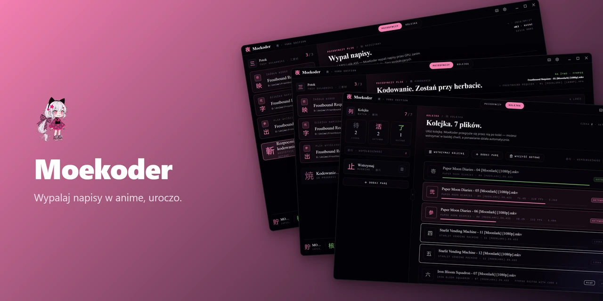
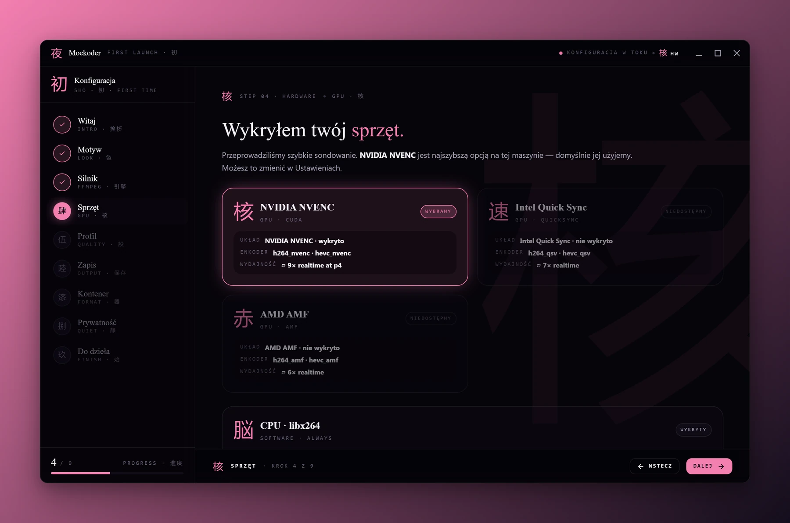
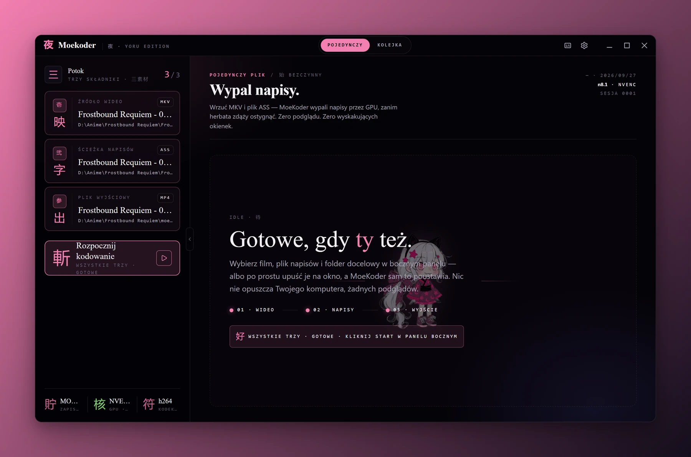
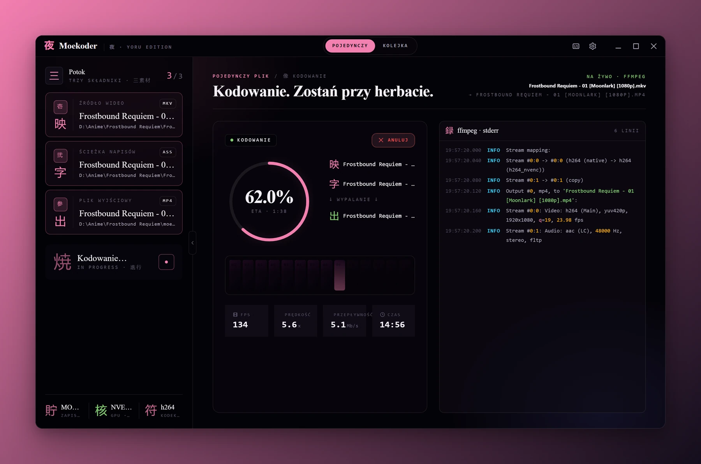
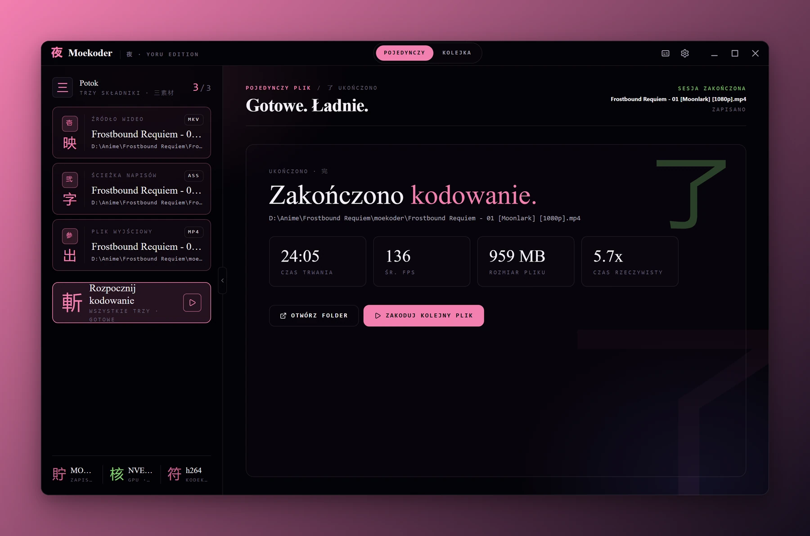
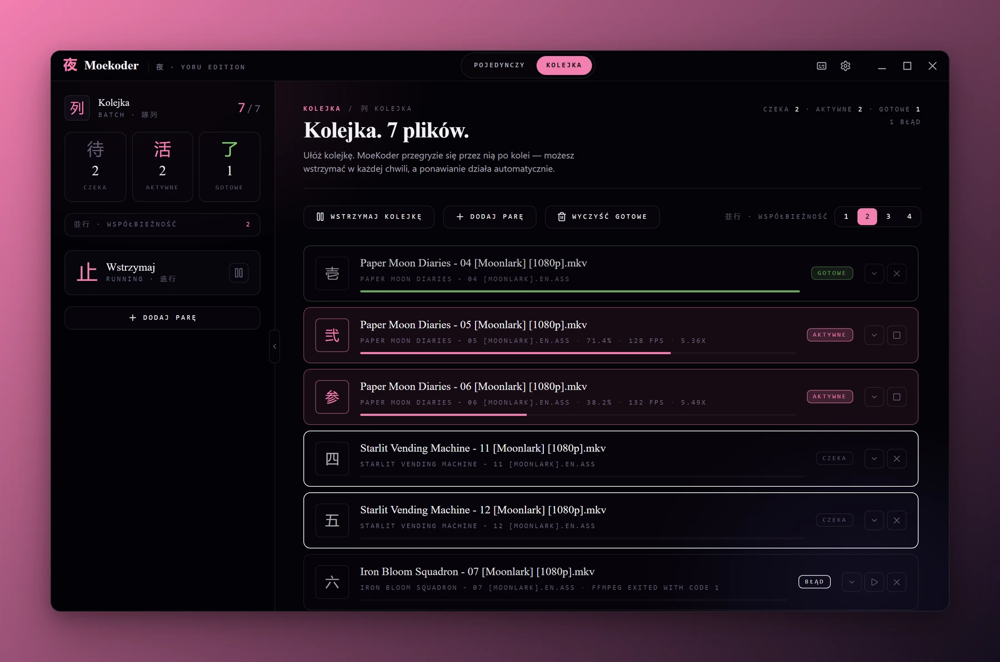
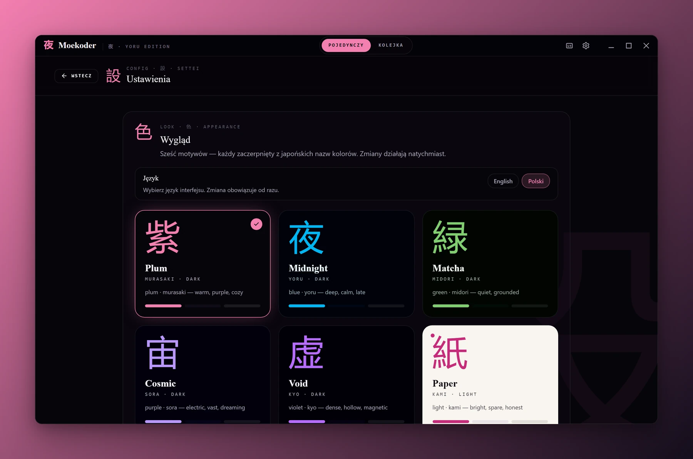
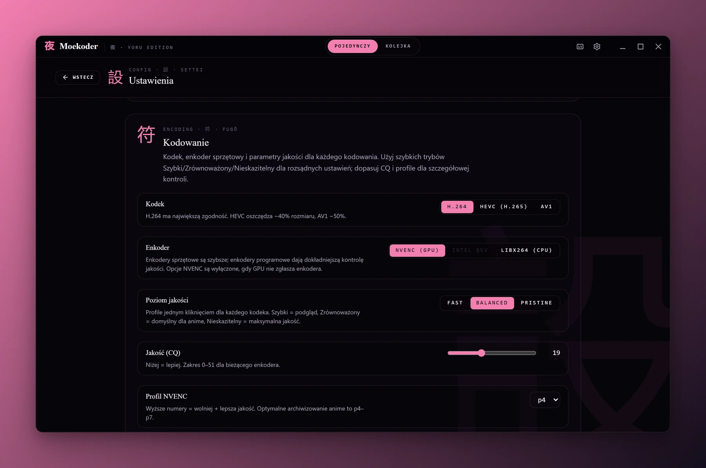
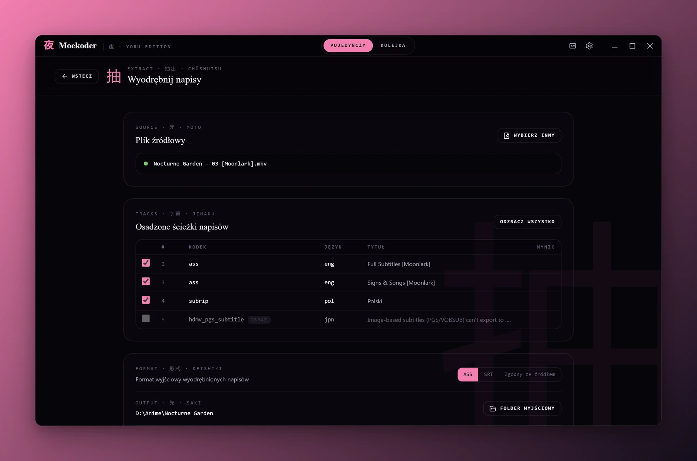

<a name="top"></a>

<div align="center">
  

  <h1>萌コーダー &nbsp;·&nbsp; Moekoder</h1>

  <p><strong>Wypalaj napisy w anime, uroczo.</strong></p>

  <p>
    <a href="https://github.com/Shironex/moekoder/releases/latest">
      
    </a>
    <a href="https://github.com/Shironex/moekoder/actions/workflows/ci.yml">
      
    </a>
    
    <a href="LICENSE">
      
    </a>
  </p>

  <p>
    <a href="https://github.com/Shironex/moekoder/releases/latest"><strong>Pobierz</strong></a>
    &nbsp;·&nbsp;
    <a href="CHANGELOG.md"><strong>Lista zmian</strong></a>
    &nbsp;·&nbsp;
    <a href="README.md">English</a>
  </p>

  <blockquote>
    <p>Dla osób, które trzymają anime na dysku i wiedzą, co znaczą NVENC i CQ. Wrzucasz MKV z napisami ASS, dostajesz MP4 z wypalonymi napisami.</p>
  </blockquote>
</div>

---

## Czym jest Moekoder?

Moekoder to aplikacja desktopowa do wypalania napisów w wideo. Zbudowałem ją tak, żeby z pliku MKV i jego napisów ASS robiła plik MP4 (albo MKV) obok źródła: napisy wypala libass przez ffmpeg, a dźwięk jest kopiowany, gdy tylko pozwala na to kontener. Jeśli komputer ma NVENC, Quick Sync albo AMF, Moekoder z nich korzysta, a jeśli nie, koduje na procesorze przez libx264. Wszystko dzieje się lokalnie, w spokojnym oknie w ciemnych, śliwkowych barwach, które nie przeszkadza w pracy.

Moekoder jest częścią mojego Shiro Suite, obok [ShiroAni](https://github.com/Shironex/shiroani) (anime), [Shiranami](https://github.com/Shironex/shiranami) (muzyka) i [KireiManga](https://github.com/Shironex/kirei-manga) (manga).

## Zrzuty ekranu

<table>
  <tr>
    <td width="50%"></td>
    <td width="50%"></td>
  </tr>
  <tr>
    <td align="center"><sub>Kreator wykrywa kartę graficzną i sam instaluje ffmpeg.</sub></td>
    <td align="center"><sub>Wybierz wideo i napisy, a potem kliknij Rozpocznij kodowanie.</sub></td>
  </tr>
  <tr>
    <td width="50%"></td>
    <td width="50%"></td>
  </tr>
  <tr>
    <td align="center"><sub>Pierścień postępu, taśma klatek i log ffmpeg z fps, prędkością i pozostałym czasem.</sub></td>
    <td align="center"><sub>Gotowy plik z czasem trwania, średnim fps, rozmiarem i prędkością.</sub></td>
  </tr>
  <tr>
    <td width="50%"></td>
    <td width="50%"></td>
  </tr>
  <tr>
    <td align="center"><sub>Cały sezon w kolejce, dwa odcinki kodowane jednocześnie.</sub></td>
    <td align="center"><sub>Sześć motywów i język interfejsu, zmieniane od razu.</sub></td>
  </tr>
  <tr>
    <td width="50%"></td>
    <td width="50%"></td>
  </tr>
  <tr>
    <td align="center"><sub>H.264, HEVC lub AV1, enkoder sprzętowy i poziom jakości.</sub></td>
    <td align="center"><sub>Osadzone ścieżki napisów z pliku MKV, zapisane jako ASS lub SRT.</sub></td>
  </tr>
</table>

## Co znajdziesz w środku

|                              |                                                                                                                                                                                                                                                        |
| ---------------------------- | ------------------------------------------------------------------------------------------------------------------------------------------------------------------------------------------------------------------------------------------------------ |
| **Wypalanie napisów**        | MKV i ASS na wejściu, MP4 albo MKV na wyjściu, z napisami wypalonymi przez libass. H.264, HEVC lub AV1                                                                                                                                                 |
| **Kodowanie sprzętowe**      | Wykrywa NVIDIA NVENC, Intel Quick Sync i AMD AMF, a każdy enkoder sprawdza testowym kodowaniem jednej klatki, zanim go zaproponuje. libx264 na procesorze działa zawsze                                                                                |
| **Miękkie napisy**           | Tryb „Tylko muksowanie” kopiuje obraz i dźwięk i dodaje napisy jako osobną ścieżkę w pliku MKV, bez ponownego kodowania. Język ścieżki bierze się z nazwy pliku (`.en.ass`) albo z ręcznego ustawienia                                                 |
| **Wyodrębnianie napisów**    | Otwiera plik MKV, pokazuje jego ścieżki napisów i zapisuje tekstowe jako ASS, SRT albo w formacie źródłowym. Ścieżki obrazkowe (PGS, VobSub) są widoczne, ale nie da się ich wyeksportować                                                             |
| **Profile i benchmark**      | Poziomy Szybki, Zrównoważony i Nieskazitelny dla każdego kodeka, własne nazwane profile oraz benchmark, który koduje 10-sekundowy fragment maksymalnie czterema profilami i porównuje rozmiar, czas i PSNR                                             |
| **Instalator ffmpeg**        | ffmpeg nie jest dołączony do aplikacji. Przy pierwszym uruchomieniu Moekoder go pobiera (buildy BtbN na Windowsie, evermeet.cx na macOS), sprawdza sumę SHA-256 i instaluje w folderze danych aplikacji. W Ustawieniach można go zainstalować ponownie |
| **Miejsce na dysku**         | Szacuje rozmiar pliku wynikowego na podstawie bitrate'u i przed startem kodowania albo kolejki sprawdza, czy na dysku jest dość miejsca, z zapasem                                                                                                     |
| **Miejsce zapisu**           | Folder `moekoder` obok źródła, folder źródła, folder `subbed` albo dowolny wybrany folder                                                                                                                                                              |
| **Kolejka**                  | Zapisywana na dysku na bieżąco, więc przetrwa restart. Od 1 do 4 zadań naraz, pauza, ponawianie z rosnącymi odstępami, zmiana kolejności przeciąganiem, log każdej pozycji i powiadomienie po zakończeniu                                              |
| **Przeciągnij i upuść**      | Upuść wideo z napisami (albo cały folder) na okno, a Moekoder dopasuje pliki po nazwach                                                                                                                                                                |
| **Osadzone czcionki**        | Czcionki dołączone do pliku MKV trafiają do libass, więc typesetting z fansubów wyświetla się właściwymi czcionkami. Można to wyłączyć w Ustawieniach                                                                                                  |
| **Dźwięk bez niespodzianek** | Dźwięk jest kopiowany bez zmian. Przy wyjściu MP4 ścieżki TrueHD, DTS, FLAC i PCM (których MP4 nie obsługuje) są konwertowane do AAC 192k                                                                                                              |
| **Postęp na żywo**           | Pierścień postępu, taśma klatek i log ffmpeg z fps, prędkością, bitrate'em i pozostałym czasem                                                                                                                                                         |
| **Motywy i języki**          | Sześć motywów (Plum, Midnight, Matcha, Cosmic, Void, Paper) przełączanych na żywo. Interfejs po polsku i po angielsku, dobierany przy pierwszym uruchomieniu do języka systemu                                                                         |
| **Konfiguracja w 9 krokach** | Pierwsze uruchomienie prowadzi przez motyw, ffmpeg, kartę graficzną, profil, miejsce zapisu, kontener i prywatność                                                                                                                                     |
| **Aktualizacje**             | Windows: sprawdza GitHub Releases (automatyczne sprawdzanie trzeba włączyć), pobiera aktualizację na żądanie i instaluje ją przy zamknięciu. macOS: bez aktualizacji w aplikacji, dopóki nie ma podpisu; przycisk otwiera Releases                     |
| **Logi**                     | Jedno kliknięcie w Ustawieniach otwiera folder z logami                                                                                                                                                                                                |

## Jak zacząć

Pobierz najnowszą wersję ze strony [Releases](https://github.com/Shironex/moekoder/releases/latest).

### Windows

1. Pobierz instalator `.exe`.
2. Uruchom go. Windows może pokazać ostrzeżenie SmartScreen, bo aplikacja nie ma podpisu cyfrowego: kliknij **„Więcej informacji”**, a potem **„Uruchom mimo to”**.
3. Pierwsze uruchomienie przeprowadzi cię przez konfigurację (tu pobiera się ffmpeg, jednorazowo około 180 MB).

### macOS

1. Pobierz plik `.dmg`.
2. Otwórz go i przeciągnij Moekoder do folderu Aplikacje.
3. macOS zablokuje aplikację, bo nie ma podpisu cyfrowego. Otwórz Terminal i wpisz:
   ```bash
   xattr -cr /Applications/Moekoder.app
   ```
   Trzeba to powtarzać po każdej aktualizacji, dopóki aplikacja nie będzie podpisana.
4. Pierwsze uruchomienie przeprowadzi cię przez konfigurację.

## Technologie

|               |                                                                                            |
| ------------- | ------------------------------------------------------------------------------------------ |
| Desktop       | Electron 43                                                                                |
| Frontend      | React 19, Vite 8, Tailwind CSS 4                                                           |
| Stan          | Zustand 5                                                                                  |
| UI            | Radix UI, ikony Lucide                                                                     |
| Tłumaczenia   | i18next, react-i18next                                                                     |
| Strona        | Astro 7 z wyspami React                                                                    |
| Kodowanie     | FFmpeg (pobierany przy pierwszym uruchomieniu, niedołączany do aplikacji) i libass         |
| Ustawienia    | electron-store                                                                             |
| Aktualizacje  | electron-updater                                                                           |
| Archiwa       | yauzl (rozpakowywanie zipów w instalatorze ffmpeg)                                         |
| Schematy      | zod (walidacja IPC)                                                                        |
| Jakość kodu   | ESLint, Prettier, Husky, lint-staged                                                       |
| Testy         | Vitest                                                                                     |
| Zrzuty ekranu | [@noctcore/showcase-kit](https://www.npmjs.com/package/@noctcore/showcase-kit), Playwright |
| CI/CD         | GitHub Actions, electron-builder                                                           |

## Budowanie ze źródeł

Potrzebujesz [Node.js](https://nodejs.org/) w wersji 22.22.1 lub nowszej (zobacz `.nvmrc`) i [pnpm](https://pnpm.io/) (repozytorium przypina `pnpm@10.9.0` w polu `packageManager`).

```bash
git clone https://github.com/Shironex/moekoder.git
cd moekoder
pnpm install
pnpm dev
```

`pnpm dev` uruchamia renderer Vite na `localhost:15180`, czeka, aż zacznie odpowiadać, i otwiera Electrona, który go wczytuje.

<details>
<summary>Wszystkie polecenia</summary>

```bash
pnpm dev                          # Renderer + Electron
pnpm dev:landing                  # Tylko strona Astro
pnpm build                        # Build web + desktop
pnpm build:landing                # Build strony
pnpm lint                         # ESLint
pnpm format:check                 # Prettier
pnpm -r typecheck                 # Sprawdzenie typów we wszystkich pakietach
pnpm test                         # Testy desktopu (Vitest)
pnpm --filter @moekoder/web test  # Testy renderera (Vitest)
pnpm package                      # Build i paczka dla bieżącego systemu
pnpm package:win                  # Build i paczka dla Windowsa (NSIS)
pnpm package:mac                  # Build i paczka dla macOS (DMG)
pnpm generate-icons               # Ikony aplikacji z apps/desktop/resources/mascot.png
pnpm version:patch                # Podbicie wersji, commit i tag (także minor / major)
pnpm showcase                     # Nowe zrzuty ekranu i banery do README
```

</details>

### Struktura projektu

```
moekoder/
├── apps/
│   ├── desktop/              # Proces główny Electrona (bundlowany esbuildem)
│   │   ├── src/main/         # Start, okno, CSP, logger, aktualizacje
│   │   │   ├── ffmpeg/       # Instalator, sondy, argumenty, parser wyjścia, proces
│   │   │   ├── encode/       # Orkiestrator i benchmark
│   │   │   ├── queue/        # Kolejka: menedżer, zapis na dysk, sprawdzanie miejsca
│   │   │   └── ipc/          # Typowane handlery, schematy zod, obsługa błędów
│   │   ├── resources/        # Źródłowy PNG maskotki (dla generate-icons)
│   │   └── build/            # Wygenerowane ikony + wynik electron-builder
│   ├── landing/              # Strona w Astro
│   └── web/                  # Renderer React + Vite
│       ├── src/screens/      # Splash, Idle, Encoding, Done, Queue, Extract, Settings, About, onboarding/
│       ├── src/stores/       # Magazyny Zustand (widok, kodowanie, kolejka, konfiguracja)
│       ├── src/locales/      # Teksty po angielsku i po polsku
│       └── src/showcase/     # Wymyślone dane demo dla `pnpm showcase` (tylko tryb showcase)
├── packages/
│   └── shared/               # Typy, kanały IPC, schemat ustawień, logger, motywy, stałe
├── assets/showcase/          # Zrzuty ekranu i banery do README
├── scripts/                  # bump-version, generate-icons, showcase-extras
└── docs/                     # Plany i notatki projektowe (w .gitignore)
```

## Zrzuty ekranu w README

Zrzuty ekranu i banery powyżej generuje `pnpm showcase`, oparty na [`@noctcore/showcase-kit`](https://www.npmjs.com/package/@noctcore/showcase-kit). Buduje sam renderer w trybie showcase z wymyślonymi danymi demo (bez Electrona, bez ffmpeg, bez prawdziwych plików), robi zrzuty każdego ekranu po angielsku i po polsku i zapisuje je w `assets/showcase/`. Konfiguracja jest w `showcase.config.mjs`. Przy pierwszym uruchomieniu Playwright potrzebuje przeglądarki:

```bash
pnpm exec playwright install chromium
pnpm showcase
```

Żeby dodatkowo wyeksportować obrazy do portfolio, ustaw `SHOWCASE_PORTFOLIO_DIR` na folder docelowy (ścieżka względna liczy się od katalogu repozytorium). Eksport tylko dodaje tam pliki:

```bash
# macOS / Linux / Git Bash
SHOWCASE_PORTFOLIO_DIR=../portfolio/public/projects/moekoder pnpm showcase
```

```powershell
# Windows PowerShell
$env:SHOWCASE_PORTFOLIO_DIR = '../portfolio/public/projects/moekoder'; pnpm showcase
```

## Wydania

`pnpm version:patch` (albo `version:minor` / `version:major`) podbija wersję we wszystkich pakietach, robi commit i tag `vX.Y.Z`. Opublikowanie wydania na GitHubie z tego taga uruchamia `.github/workflows/release.yml`, który buduje instalatory dla Windowsa i macOS i dołącza je do wydania. [`CHANGELOG.md`](CHANGELOG.md) piszę ręcznie.

## Licencja

Licencja Moekoder Source Available, szczegóły w pliku [LICENSE](LICENSE). Użytek osobisty i wkład przez pull requesty są dozwolone; redystrybucja, odsprzedaż i tworzenie prac pochodnych nie.

## Podziękowania

Silnikiem kodowania jest [FFmpeg](https://ffmpeg.org) ([buildy BtbN](https://github.com/BtbN/FFmpeg-Builds) na Windowsie, [evermeet.cx](https://evermeet.cx/ffmpeg/) na macOS), a napisy renderuje [libass](https://github.com/libass/libass).

<p align="right"><a href="#top">Wróć na górę ↑</a></p>
